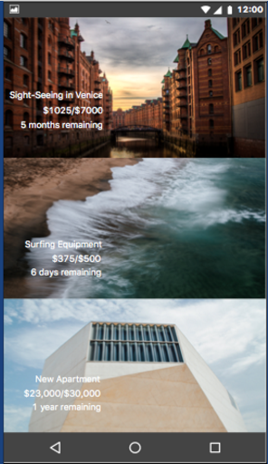
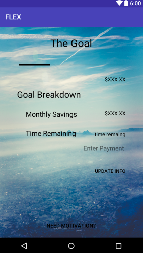

# Flex

##NBMBAA Hackathon Project
The challenge of the hackathon was to create an application to reduce the average student debt. We created an application that would help users track their debt while still keeping on their other purchases.

## License
MIT License
